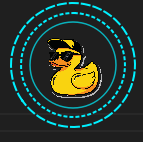
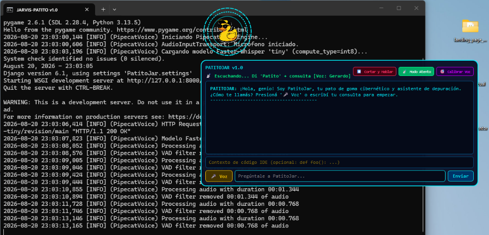
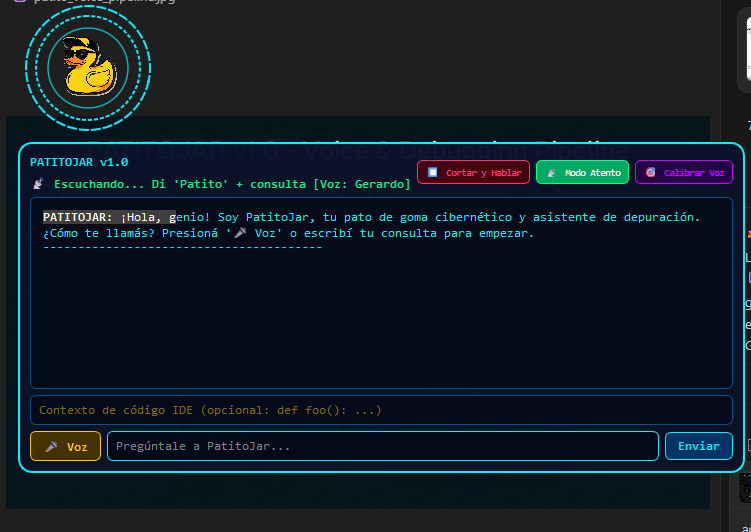
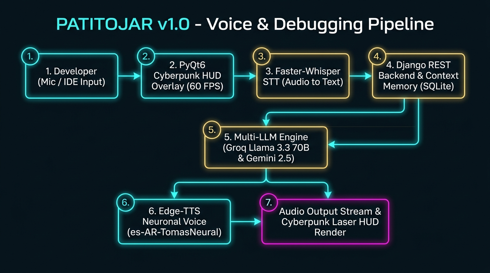
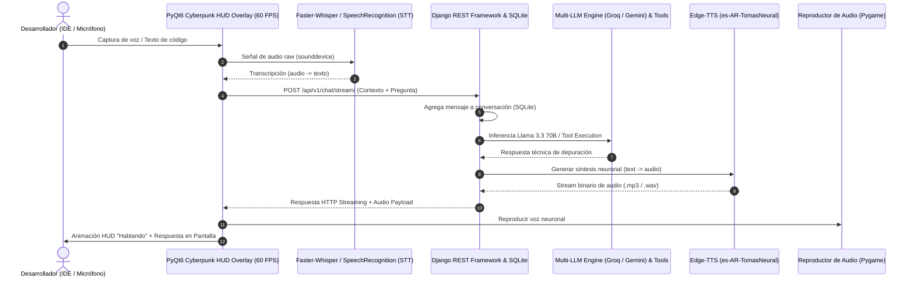

# 🐥 PatitoJar v1.0 - Cyberpunk Rubber Duck Debugger Assistant

**PatitoJar** es un asistente virtual interactivo de escritorio para depuración de código (**Rubber Duck Debugger**). Combina una elegante interfaz flotante Cyberpunk HUD proyectada a 60 FPS en **PyQt6**, un backend seguro en **Django REST Framework**, voz neuronal interactiva y la potencia computacional de Modelos de Lenguaje de Última Generación (**Groq Llama 3.3 70B** y **Google Gemini 2.5 Flash**).

---

## 📸 Capturas de Pantalla (Screenshots)

<p align="center">
  
</p>

### 🖥️ 1. Interfaz Flotante Cyberpunk HUD en Acción con Consola Django & Pipeline


### 💬 2. Ventana de Diálogo y Asistencia de Depuración en Tiempo Real


---

## 🎙️ Pipeline de Voz y Procesamiento de Depuración (Voice & Debugging Pipeline)



### 🔄 Flujo de Ejecución Detallado:



| Paso | Componente | Descripción |
| :--- | :--- | :--- |
| **① Captura Inicial** | Micrófono / Teclado | Captura de audio en vivo vía `sounddevice` o ingreso directo de código |
| **② Interfaz HUD** | PyQt6 Cyberpunk HUD | Overlay flotante Always-on-Top (60 FPS) que cambia al estado **Escuchando 🎤** |
| **③ Transcripción STT** | Faster-Whisper / SpeechRecognition | Convierte el flujo de audio capturado a texto (*Audio to Text*) |
| **④ Context Aggregator** | Django REST Backend & SQLite | Administra el historial de la sesión (`ChatSession` / `Message`) |
| **⑤ Inferencia Multi-IA & Tools**| Groq Llama 3.3 70B / Gemini 2.5 | Genera la solución técnica y ejecuta herramientas del SO (`ToolRegistry`) |
| **⑥ Síntesis de Voz TTS** | Edge-TTS (`es-AR-TomasNeural`) | Sintetiza la respuesta textual a voz neuronal natural (*Text to Audio*) |
| **⑦ Salida de Audio & Render** | Pygame Stream & Laser HUD | Reproduce la voz y muestra la animación concéntrica láser **Hablando 🗣️** |

---

## 🚀 Funcionalidades Principales

### 🦆 1. Depuración Asistida en Tiempo Real (Rubber Duck Debugging)
* **Asistencia Lógica y Refactorización:** Permite al desarrollador explicar verbalmente o pegar fragmentos de código para recibir soluciones, explicaciones y detección de bugs al instante.
* **Personalidad Integrada Elegante y Motivadora:** Responde con una personalidad amigable, entusiasta e hipercompetente, adaptada al perfil del usuario.
* **Memoria Contextual:** Registra el historial de conversaciones y contextos a corto y largo plazo mediante sesiones persistentes (`ChatSession` y `Message`).

### 🎨 2. Interfaz Gráfica Flotante Cyberpunk HUD (PyQt6)
* **Overlay Translúcido & Always-on-Top:** Ventana flotante sin bordes (*frameless*) que permanece visible sobre el IDE o editor de código.
* **Renderizado Animado a 60 FPS:** Animaciones concéntricas de anillos HUD, efectos láser y dinamismo visual según los estados del asistente:
  - 🎤 **Escuchando** (Captura de micrófono activa)
  - 🧠 **Pensando** (Procesando respuesta en backend)
  - 🗣️ **Hablando** (Sintetizando voz en tiempo real)
  - 😴 **Reposo / Idle** (Espera activa)

### 🎙️ 3. Entrada y Salida Multimodal (Voz y Texto)
* **Reconocimiento de Voz Local (STT):** Transcripción rápida y precisa del habla del usuario mediante `SpeechRecognition` y `Faster-Whisper`.
* **Síntesis de Voz Neuronal Realista (TTS):** Generación de voz natural (`es-AR-TomasNeural`) mediante `edge-tts` (con fallback local `pyttsx3`) y streaming binario de audio desde el backend.

### 🛡️ 4. Arquitectura Segura de 3 Capas & Resiliencia Multi-IA
* **Aislamiento de Credenciales:** La interfaz cliente no maneja claves de API. Todas las solicitudes pasan a través del backend Django.
* **Conmutación Automática (Fallback):** Si el motor principal (**Groq Llama 3.3 70B**) falla o se agota su límite de tasa, el sistema conmuta automáticamente a **Google Gemini 2.5 Flash** o al modo offline simulado sin interrumpir la sesión.

### 🛠️ 5. Sistema de Tool Calling y API REST Integrada
* **Automatización del Sistema:** Ejecución segura de herramientas registradas en el backend (inspección de recursos del SO, formateo de código Python, gestión de agenda).
* **Documentación Interactiva Swagger UI:** Especificación OpenAPI 3.0 accesible desde `/api/docs/` generada con `drf-spectacular`.

---

## 🏗️ Arquitectura del Sistema

```
┌─────────────────────────────────────────────────────────────┐
│ 1. CAPA CLIENTE / INTERFAZ (PyQt6 Cyberpunk HUD)            │
│  - Captura Micrófono (STT Local Faster-Whisper / VAD)       │
│  - Renderizado Animado HUD 60 FPS (Estados, Anillos, Láser) │
│  - Reproducción de Voz (TTS Local / Remote Fetch Backend)   │
│  - CERO API Keys en el Cliente                              │
└──────────────────────────────┬──────────────────────────────┘
                               │ HTTP REST / Streaming (CORS)
┌──────────────────────────────▼──────────────────────────────┐
│ 2. CAPA BACKEND SEGURO (Django REST Framework)              │
│  - Aislamiento de Credenciales (API Keys en .env)          │
│  - Endpoint /api/v1/chat/stream/ (Streaming <200ms)        │
│  - Endpoint /api/v1/tts/ (Síntesis TTS Backend)             │
│  - Motor de Herramientas (Tool Registry OS / Agenda)       │
│  - Persistencia de Memoria Corto/Largo Plazo (SQLite)       │
└──────────────────────────────┬──────────────────────────────┘
                               │ API Requests Aisladas
┌──────────────────────────────▼──────────────────────────────┐
│ 3. CAPA CEREBRO / SERVICIOS IA EXTERNOS                     │
│  - Groq API (Llama 3.3 70B Versatile)                       │
│  - Google Gemini API (2.5 Flash Fallback)                   │
│  - Edge-TTS / PyTTSx3 (Síntesis de Voz Neuronal)             │
└─────────────────────────────────────────────────────────────┘
```

---

## 📂 Estructura del Proyecto

```
PatitoJar/
├── assistant/                      # Aplicación Django principal (Motor API & Herramientas)
│   ├── migrations/                 # Migraciones de base de datos SQLite
│   ├── models.py                   # Modelos de ChatSession y Message
│   ├── serializers.py              # Serializadores de DRF
│   ├── services.py                 # Integración con Groq, Gemini, TTS y ToolRegistry
│   ├── views.py                    # Endpoints REST (/chat/, /stream/, /tts/, /tools/)
│   └── urls.py                     # Rutas API de la app assistant
├── PatitoJar/                      # Configuración del proyecto Django
│   ├── settings.py                 # Configuración general, CORS, DRF y Apps
│   ├── urls.py                     # Definición de rutas raíz y Swagger
│   └── wsgi.py                     # Entrada WSGI
├── patito_jar_overlay.py           # Cliente GUI Principal (PyQt6 Cyberpunk HUD Overlay)
├── patito_jar_voice.py             # Módulo de reconocimiento de voz y reproductor TTS
├── patito_voice_pipeline.jpg       # Diagrama de arquitectura del pipeline de voz
├── patito_hud_console.png          # Captura de pantalla de la interfaz con consola
├── patito_hud_window.png           # Captura de pantalla de la ventana flotante HUD
├── patito_hud_icon.png             # Icono animado Cyberpunk HUD de PatitoJar
├── INICIAR_PATITO.bat              # Script de inicio automatizado para Windows
├── manage.py                       # Administrador de comandos Django
├── requirements.txt                # Lista de dependencias del proyecto
├── .env.example                    # Plantilla de variables de entorno
├── .gitignore                      # Reglas de exclusión para Git
└── README.md                       # Documentación del proyecto
```

---

## 💻 Guía Paso a Paso: Clonar y Ejecutar en una PC Nueva

Sigue estas instrucciones para configurar y correr **PatitoJar** en cualquier computadora desde cero.

### 📋 Prerrequisitos
* **Python 3.10 o superior** (Recomendado Python 3.11 o 3.13). Asegúrate de marcar *"Add Python to PATH"* durante la instalación.
* **Git** instalado en el sistema.
* *(Opcional)* **FFmpeg** en las variables de entorno de la PC si deseas usar la transcripción avanzada de `faster-whisper`.

---

### 1️⃣ Paso 1: Clonar el Repositorio
Abre una terminal (PowerShell o CMD en Windows, Bash en Linux/Mac) y ejecuta:

```bash
git clone https://github.com/Gerardomedinav/PatitoJar.git
cd PatitoJar
```

---

### 2️⃣ Paso 2: Crear y Activar el Entorno Virtual

**En Windows (PowerShell):**
```powershell
python -m venv venv
.\venv\Scripts\activate
```

**En Windows (CMD):**
```cmd
python -m venv venv
venv\Scripts\activate.bat
```

**En Linux / macOS:**
```bash
python3 -m venv venv
source venv/bin/activate
```

---

### 3️⃣ Paso 3: Instalar las Dependencias
Con el entorno virtual activado, instala todos los paquetes necesarios:

```bash
pip install --upgrade pip
pip install -r requirements.txt
```

---

### 4️⃣ Paso 4: Configurar las Variables de Entorno (`.env`)
Crea un archivo llamado `.env` en la raíz del proyecto copiando la plantilla `.env.example`:

**En Windows (PowerShell):**
```powershell
Copy-Item .env.example .env
```

**En Linux / macOS / Bash:**
```bash
cp .env.example .env
```

Edita el archivo `.env` recién creado con tu editor preferido (VS Code, Notepad, etc.) e ingresa tus claves de API:

```env
GROQ_API_KEY=gsk_tu_clave_de_groq_aqui
GEMINI_API_KEY=tu_clave_de_gemini_aqui
```

> 💡 **¿Dónde obtener las API Keys gratuitas?**
> - **Groq API Key:** Consíguela gratis en [console.groq.com](https://console.groq.com/)
> - **Gemini API Key:** Consíguela gratis en [aistudio.google.com](https://aistudio.google.com/)

---

### 5️⃣ Paso 5: Preparar la Base de Datos
Ejecuta las migraciones de Django para crear las tablas necesarias en SQLite:

```bash
python manage.py migrate
```

---

### 6️⃣ Paso 6: Ejecutar la Aplicación

#### 🚀 Opción A: Inicio Automático en Windows (Recomendado)
Simplemente haz doble clic sobre el archivo `INICIAR_PATITO.bat` o ejecútalo desde la terminal:

```cmd
INICIAR_PATITO.bat
```
Este script se encargará de:
1. Iniciar el servidor Backend de Django en `http://127.0.0.1:8000`.
2. Esperar 3 segundos para la inicialización.
3. Lanzar la interfaz gráfica flotante PyQt6 HUD (`patito_jar_overlay.py`).

---

#### 🛠️ Opción B: Inicio Manual (Cualquier Sistema Operativo)
Si prefieres correrlo en terminales separadas:

**Terminal 1 (Backend Django):**
```bash
# Con el entorno virtual activado:
python manage.py runserver 8000
```

**Terminal 2 (Interfaz Flotante PyQt6 HUD):**
```bash
# Con el entorno virtual activado:
python patito_jar_overlay.py
```

---

## 🔌 Documentación de Endpoints API REST

Una vez en ejecución el servidor backend (`http://127.0.0.1:8000`), puedes acceder a:
* 📑 **Swagger UI:** `http://127.0.0.1:8000/api/docs/`
* 📌 **ReDoc:** `http://127.0.0.1:8000/api/redoc/`

### Resumen de Rutas API principales:
| Método | Endpoint | Descripción |
| :--- | :--- | :--- |
| `POST` | `/api/v1/chat/` | Envía mensaje + contexto de código y retorna respuesta completa |
| `POST` | `/api/v1/chat/stream/` | Respuesta streaming en vivo (<200ms de latencia) |
| `POST` | `/api/v1/tts/` | Sintetiza audio en servidor y devuelve stream binario `.mp3` / `.wav` |
| `GET` | `/api/v1/tools/` | Lista las herramientas registradas en el backend |
| `POST` | `/api/v1/tools/execute/` | Ejecuta de forma segura una herramienta elegida |
| `GET` | `/api/v1/sessions/` | Consulta historial de sesiones guardadas |
| `GET` | `/api/v1/messages/` | Consulta mensajes históricos detallados |

---

## 🛡️ Licencia y Créditos

Desarrollado para potenciación de programación y depuración ágil con elegancia Cyberpunk.
* **Autor:** Gerardo Medina
* **Licencia:** MIT
